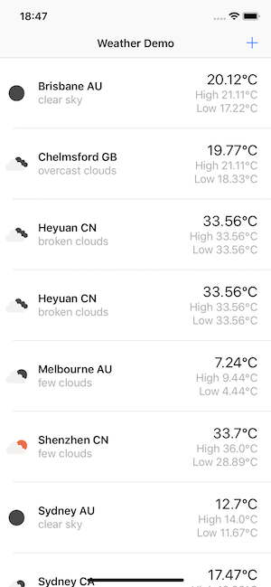
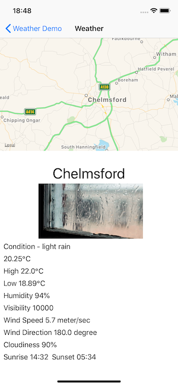

#  Weather Demo WIP

## Owner
An Xu

## Screenshots
  

## Requirements
- Xcode Version 10.3 or above
- MacOS 10.14 or above

## To run the app
1. Clone or download the source code
2. open WeatherDemo.xcworkspace with Xcode 10.3 or above
3. change the Development Team to you own one
4. build and run it

## Tasks completed
- [x] Use a UITableViewController to display weather information of Sydney, Melbourne and Brisbane as start
- [x] Provide a way to add more cities using another modal view controller which includes a search functionality to find a city by name or location
- [x] Each cell should display at least two pieces of info: Name of city on the left, temperature on the right
- [x] Get real time weather information
- [x] Weather should be automatically updated periodically, auto refresh in Weather Cities list and the Weather detail view
- [x] Use Storyboard and Autolayouts
### Brownie Points
- [x] Use an activity indicator to provide some feedback to user while waiting for network response
- [x] Allow user to tap on a cell to open a new “Detail view”
- [x] In the “Detail view”, implement animations to enhance the user experience
- [x] Support all different dimensions of the devices
- [x] Support landscape and portrait view together

### Extra functions
- [x] Swipe to delete city

## Unit Tests
All tests are in LogicTests target, to run the unit tests switch the active scheme to LogicTecTest , and run "Test"

## Assumptions and Limitations
- As switching between metric/imperial system are not required, use metric as default
- For demo purpose weather refresh every 10 seconds
- Cities are sorted by it's name

## Third Party Frameworks
- SDWebImage
